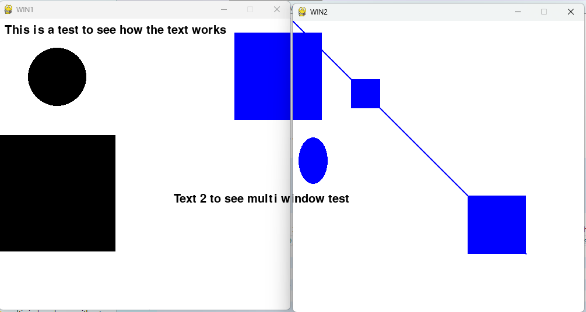
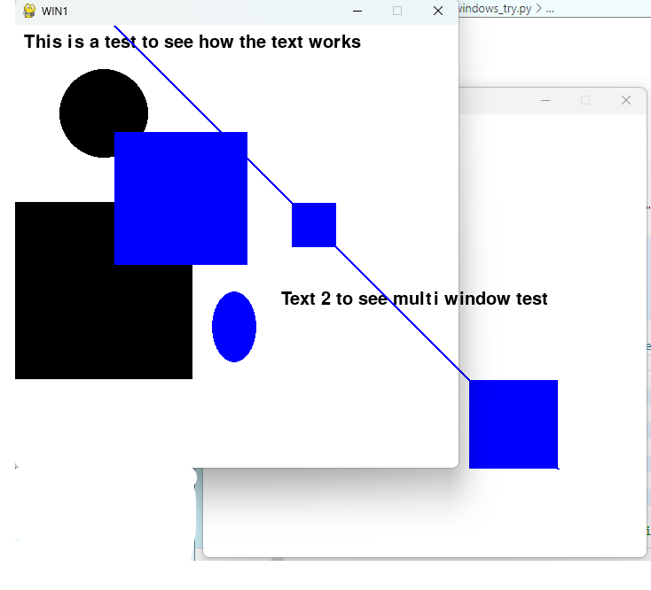

# multiprocessing-and-multiwindows

Using multiprocessing to have 2 windows and sharing shapes and text between them

<ul>
  <h2>Versions:</h2>
  <li>V1: the windows have only rects, the rects are shown on the other window only when the windows collide</li>
  <li>V2: same as version 1 but with more shapes and with text</li>
  <li>V3: thr shapes and text can be shown on the other window even if the windows don't collide</li>
</ul>
<h2>Image examples:</h2>

