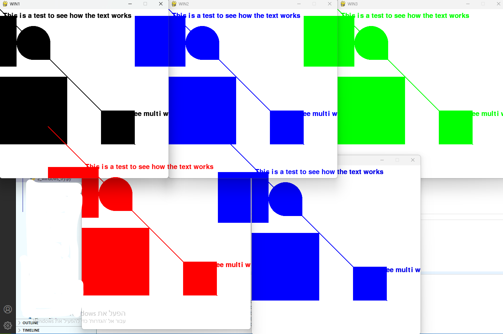

# multiprocessing-and-multiwindows

Using multiprocessing to have 2 windows and sharing shapes and text between them

Using multiprocessing to create seperated windows on the same display and using shared dict to comunicate between them, using the dict we can calculate what shapes and texts are shown where

<ul>
  <h2>Versions:</h2>
  <li>V1: The windows have only rects, the rects are shown on the other window only when the windows collide</li>
  <li>V2: Same as version 1 but with more shapes and with text</li>
  <li>V3: The shapes and text can be shown on the other window even if the windows don't collide</li>
  <li>V4: Same as V3 but now it is possible to choose the number of windows, no limitations in how much windows there will be</li>
</ul>
<h2>Image examples:</h2>
<b>V2:</b>

<b>V3:</b>

<b>V4:</b>

